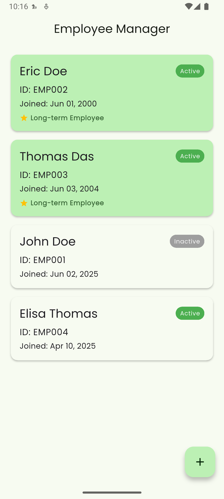
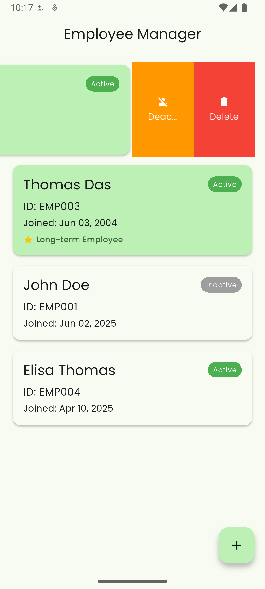
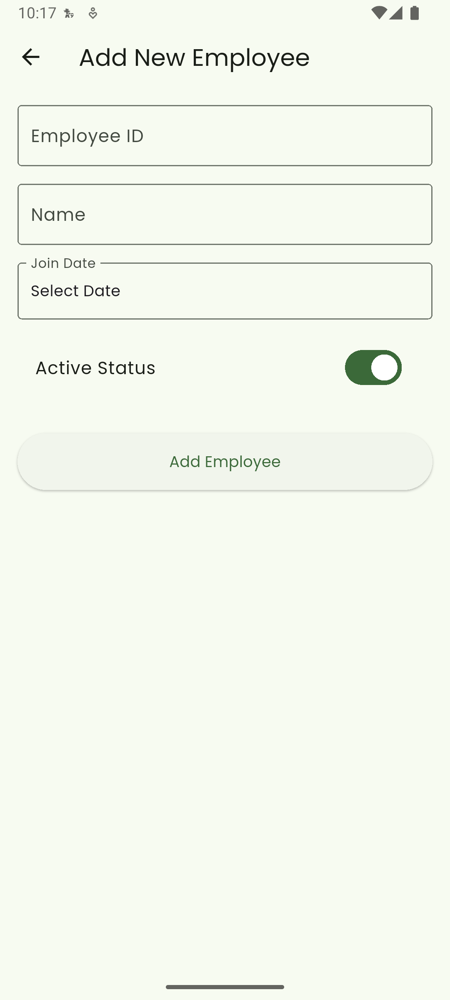
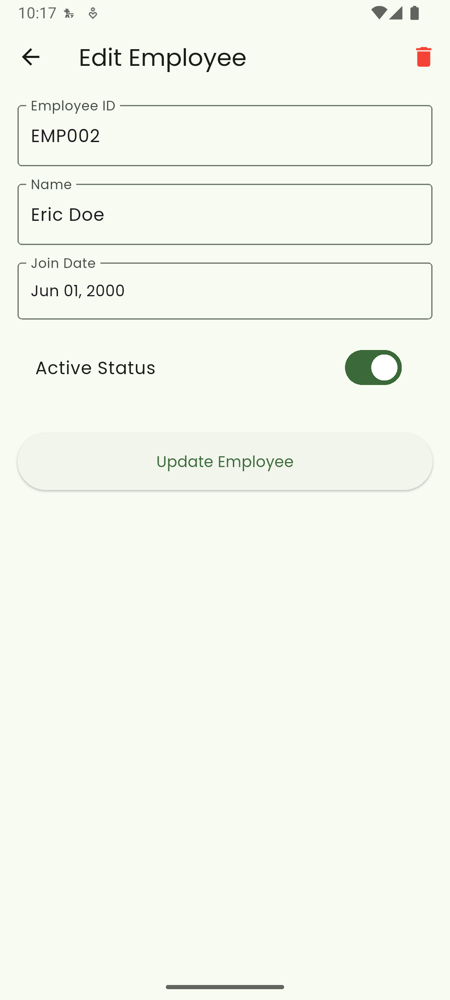

# Employee Manager

Track and highlight long-term employees in your organization.

## Screenshots

<div style="display: flex; flex-wrap: wrap; gap: 10px;">
  
  
  
  
</div>

## Download

[⬇️ Download APK](https://drive.google.com/file/d/1ZnQXg9KMGARPrkTrnYPZa7NepqMXLktQ/view?usp=sharing)  

## Setup

1. Create a Firebase project at [Firebase Console](https://console.firebase.google.com)
2. Enable Firestore Database
3. Download `google-services.json` from Firebase Console:
   - Go to Project Settings > Your Apps
   - Download the file
   - Place it in `android/app/`

## Firebase Configuration

Firestore collection structure:
```
employees/
  - employeeId: string
  - name: string
  - joinDate: timestamp
  - isActive: boolean
```

## Development

Requirements:
- Flutter 3.0+
- Firebase project
- Android Studio / VS Code

```bash
# Install dependencies
flutter pub get

# Run the app
flutter run
```

## Features

- Real-time employee list
- Auto-highlights employees with 5+ years tenure
- Add/Edit employee details
- Toggle active status
- Material 3 design with dark mode support
